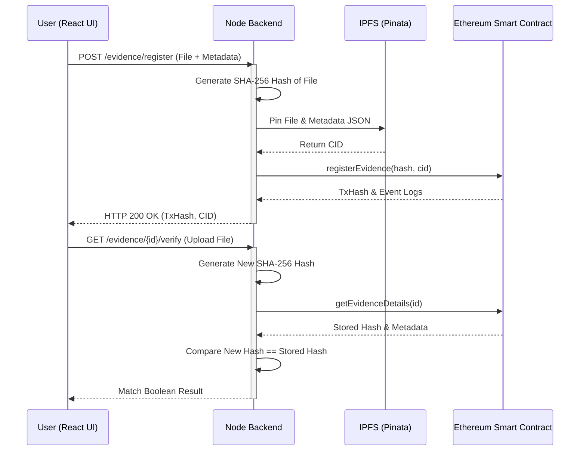

# System Architecture

This diagram illustrates the primary data flow and relationship between the components.

```mermaid
sequenceDiagram
    participant User (React UI)
    participant Node Backend
    participant IPFS (Pinata)
    participant Ethereum Smart Contract

    %% Evidence Registration Flow
    User (React UI)->>Node Backend: POST /evidence/register (File + Metadata)
    activate Node Backend
    Node Backend->>Node Backend: Generate SHA-256 Hash of File
    Node Backend->>IPFS (Pinata): Pin File & Metadata JSON
    IPFS (Pinata)-->>Node Backend: Return CID
    Node Backend->>Ethereum Smart Contract: registerEvidence(hash, cid)
    Ethereum Smart Contract-->>Node Backend: TxHash & Event Logs
    Node Backend-->>User (React UI): HTTP 200 OK (TxHash, CID)
    deactivate Node Backend

    %% Evidence Verification Flow
    User (React UI)->>Node Backend: GET /evidence/{id}/verify (Upload File)
    activate Node Backend
    Node Backend->>Node Backend: Generate New SHA-256 Hash
    Node Backend->>Ethereum Smart Contract: getEvidenceDetails(id)
    Ethereum Smart Contract-->>Node Backend: Stored Hash & Metadata
    Node Backend->>Node Backend: Compare New Hash == Stored Hash
    Node Backend-->>User (React UI): Match Boolean Result
    deactivate Node Backend
```
